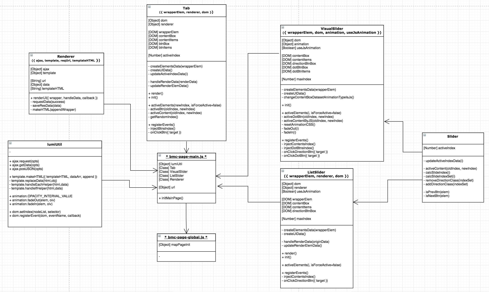

# 리팩토링 1차 - 객체의 역할과 정의 세우기, 범용성 개선

관련이슈 : https://github.com/code-squad/javascript-food/pull/20

## 리팩토링 목표

1. 코드전체가 `구조별 역할와 원칙(어떤 정의로, 어떤 규칙을 가지고 있나)`을 가지고 `스스로 설명`되도록 수정
2. 좀 더 범용성있게 사용할 수 있도록 수정

## 사용범위 (코드 사용 범위를 가정함)

* 배민찬 사이트 전체

## 파일별 정의 (호출순서대로)

* 라이브러리
  * **polyfill.js** : 브라우저별 지원하지 않는 기능을 보충하는 코드 조각 모음
* 객체정의
  * **lumi-util.js** : 유틸성격의 정적 객체 모음 (ajax, animation, template, dom)
  * **bmc-ui/*.js** : 배민찬에서 사용되는 UI객체 모음 / 각 UI별로 돔, Util, 옵션값 등을 동적으로 받는 클래스 객체들
* 객체사용
  * **bmc-page-main.js** : page별로 사용되는 객체 호출 코드를 각각 파일로 분류하여 만듦
  * **bmc-page-global.js** : page별 코드 호출

## 클래스역할 및 메서드 구성

* 클래스 공통 (all)
  * constructor :  this바인딩 변수, init()호출
  * init : 인스턴스 생성과 동시에 무조건 한번 호출되야하는 메서드들
* UI 클래스 (Tab, VisualSlider, ListSlider)
  * 인스턴스 생성시 dom은 wrapper element 하나만 넘기기. / 나머지 dom은 규칙을 갖고 의존하는 구조 (마크업이 규칙적인 구조와 셀렉터를 가지고 있다고 가정)
  * UI의 공통적인 사이클(?) 이 있고 순서대로 메서드 기술
    * (DOMLoadedContent 이후) -> ajax, render -> ui active + event binding
  * 외부에서 사용하는 메서드는 없고, 내부 메소드들 끼리 참조해서 호출하고 있음.
* UI 보조 클래스
  * ClientRenderer
    * 모든 UI클래스들이 클라이언트 사이드 렌더링이 필요한 경우에, 공통적으로 필요한 기능들을 별도 클래스로 만듦.
      * UI클래스들 안에서 instance를 생성하면 renderUI 메서드 한번만 호출하면 되고, 세부적인 과정을 보이지 않도록 추상화시킴.
    * 데이터를 가져오는 방법이 다양할 수 있으므로 생성시 매개변수로 주입하여 사용할 수 있게 함.
      * 예) ajax, localStorage, cache 등등...
    * (아래 과정들이) 비동기적으로 일어날 수 있고, 순서가 보장되어야 함. ==> `async, await 사용`
      * 과정 : data 를 받은 후 -> 클라이언트 사이드 렌더링에 유리하도록 data를 조작하여 -> template 과 합쳐진 HTML을 -> append 한다.

## 그 외 변경내용

* Util
  * 배민찬 사이트에서 쓰는 util만 정리하고 나머지는 제거
  * util의 의존성을 낮추기 위해 간단한 메서드는 중복되더라도 직접 사용 (ex. number.random)
* UI 클래스
  * List Slider와 Visual Slider의 공통적인 기능을 부모 클래스인 Slider로 분리하고 상속받게 함.
  * 추상화 레벨을 맞추려 노력
  * 렌더링은 옵션이라고 생각. 렌더링할때 안한때 다 유연하게 동작하도록 분리하는걸 고민 많이함.
* 전체
  * 객체를 정의하는 부분에서 예약된 규칙을 최대한 없애고, 객체생성시 주입받도록 변경
  * 객체를 정의하는 쪽과 사용하는 쪽으로 파일 분리
  * 객체 기능을 짤 때 메서드명으로만 먼저 설계하고 그 뒤 상세 구현하는 방식으로 리팩토링 설계.
  * 변수명을 `디자인에서 -> 역할기준`으로 변경 (ex. arrow-btn -> direction-btn / imgItems -> contentItems )
    * UI끼리 모양이 다를 수는 있어도, 역할이 비슷한 것이 많아 좀 더 일관적으로 변수명 선언 가능해짐. (읽고, 기억하기 쉬워짐)
    * box > group > items
  * reduce 사용

* UX 개선 : Visual Slider 의 화살표 버튼 클릭영역 구분
  * 변경전) .img-box a { width: 100% } 로 배경이미지링크 클릭영역이 화살표 버튼과 겹쳐져 마우스로 구분이 안감
  * 변경후) .img-box a { width: $main-width; margin: 0 auto; } 로 하여 화살표 버튼과 클릭영역이 구분됨

## 객체 관계도

